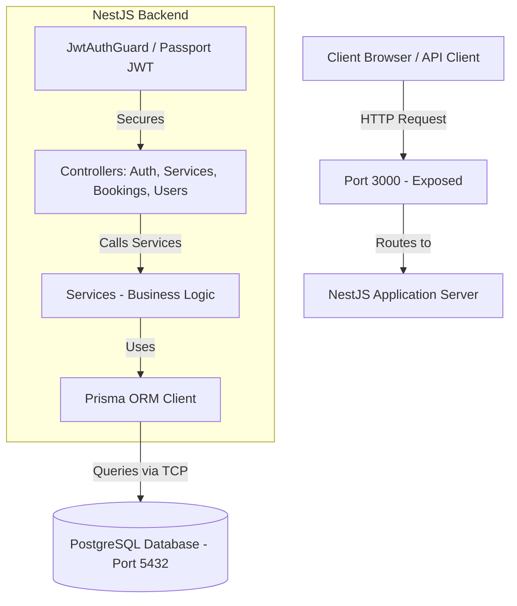
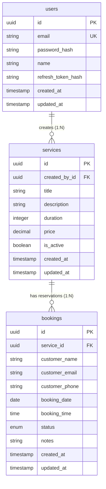
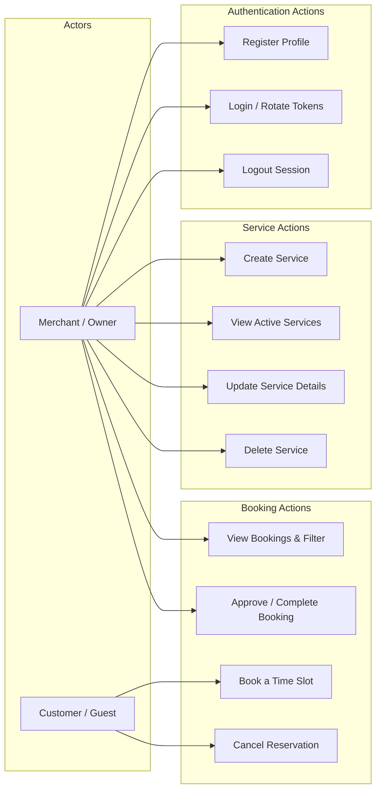

# Booking Platform REST API

An enterprise-grade, high-performance **Booking Platform REST API** built with **NestJS**, **TypeScript**, and **PostgreSQL (via Prisma ORM)**. This API allows merchants to register accounts, manage services, and customers to book appointment reservation slots with database-level collision prevention, secure authentication, and fully enveloped request/response architectures.

---

## 🌐 Live URL & API Documentation

The production environment is live and fully accessible:
* **Interactive API Documentation (Swagger UI)**: 
  👉 **[http://178.128.17.103:3000/docs](http://178.128.17.103:3000/docs)**
* **Swagger JSON Spec URL**: `http://178.128.17.103:3000/docs-json`
* **Swagger YAML Spec URL**: `http://178.128.17.103:3000/docs-yaml`

---

## 🎨 System Diagrams

### 1. System Architecture


### 2. Entity Relationship Diagram (ERD)


### 3. Application Use Cases


---

## 🛠️ Tech Stack & Tooling

* **Backend Framework**: NestJS (v11) with modular dependency injection pattern
* **Programming Language**: TypeScript (ES2023 target)
* **Database Management**: PostgreSQL (v16) with Prisma ORM
* **Authentication**: Passport.js with Dual Tokens (Access & Refresh JWT rotating scheme)
* **Security & Hashing**: Argon2 for passwords and refresh token hashes
* **Input Validation**: class-validator & class-transformer for DTO sanitization
* **Containerization**: Docker & Docker Compose
* **CI/CD Pipeline**: GitHub Actions with remote Docker Hub publish and automated SSH deployment
* **API Documentation**: Swagger (OpenAPI 3.0 specification)

---

## ⚙️ Environment Variables

A `.env.example` file is included in the project root. Create a `.env` file in the root directory and configure the variables:
```bash
cp .env.example .env
```

| Key | Example Value | Description |
| :--- | :--- | :--- |
| `PORT` | `3000` | Port the API server listens on inside and outside the container. |
| `NODE_ENV` | `production` | Execution mode (`development` or `production`). |
| `DATABASE_HOST` | `db` | Database host hostname (`db` for Docker Compose, `localhost` for local run). |
| `DATABASE_PORT` | `5432` | PostgreSQL database TCP port. |
| `DATABASE_USER` | `postgres` | Username for database authentication. |
| `DATABASE_PASSWORD` | `your_secure_password` | Password for database authentication. |
| `DATABASE_NAME` | `booking_platform` | Name of the PostgreSQL database catalog. |
| `DATABASE_URL` | `postgresql://...` | Full connection URL string used by Prisma ORM. |
| `JWT_SECRET` | `super_secret_access_key` | Secret key used to sign and verify short-lived Access Tokens. |
| `JWT_REFRESH_SECRET` | `super_secret_refresh_key`| Secret key used to sign and verify long-lived Refresh Tokens. |
| `DOCKER_REGISTRY_USER` | `your_dockerhub_username` | Your Docker Hub namespace where images are pushed. |

---

## 📦 Installation & Setup

### Option 1: Running with Docker Compose (Recommended)
This approach builds and runs the application and database without needing Node.js or PostgreSQL installed on your host machine.

1. **Clone the Repository**:
   ```bash
   git clone https://github.com/MircoFernando/booking-platform-api.git
   cd booking-platform-api
   ```
2. **Configure environment settings**:
   ```bash
   cp .env.example .env
   # Open .env and adjust credentials
   ```
3. **Start the development containers**:
   ```bash
   docker compose up -d --build
   ```
   *This command spins up the Postgres database, runs all database migrations, compiles the code in dev mode, and maps local workspace changes in real-time.*
4. **Access the API**:
   👉 Swagger UI: **`http://localhost:3000/docs`**

---

### Option 2: Running Locally (Bare Metal)
Choose this option if you want to run and debug the server directly on your host.

1. **Install Dependencies**:
   ```bash
   npm install --legacy-peer-deps
   ```
2. **Launch the database container only**:
   ```bash
   docker compose up -d db
   ```
3. **Generate Prisma Client and apply migrations**:
   ```bash
   npx prisma generate
   npx prisma migrate dev --name init
   ```
4. **Start the application**:
   ```bash
   # Development mode with watch loop
   npm run start:dev

   # Production mode compilation & startup
   npm run build
   npm run start:prod
   ```

---

## 🗄️ Database Setup & Migrations

We follow standard Prisma migrations workflows:

* **Syncing schema adjustments in development (fast iteration)**:
  ```bash
  npx prisma db push
  ```
* **Creating a new migration file after changes inside `schema.prisma`**:
  ```bash
  npx prisma migrate dev --name <migration-name>
  ```
* **Resetting database migration state (warning: drops all data)**:
  ```bash
  npx prisma migrate reset --force
  ```
* **Applying pending migrations in production (deployments)**:
  ```bash
  npx prisma migrate deploy
  ```

---

## 📖 API Endpoint Directory

All responses are wrapped in a standard JSON envelope:
* **Success Envelope**: `{ success: true, data: [...], meta: { requestId, timestamp, apiVersion } }`
* **Error Envelope**: `{ success: false, error: { statusCode, message }, meta: { ... } }`

### Summary Table

| Route | Method | Authentication | Description |
| :--- | :--- | :--- | :--- |
| `/api/v1/auth/register` | `POST` | Public | Register a new merchant user profile. |
| `/api/v1/auth/login` | `POST` | Public | Exchange credentials for Dual JWT Tokens (Access/Refresh). |
| `/api/v1/auth/logout` | `POST` | Required | Invalidate and clear refresh token hash. |
| `/api/v1/auth/refresh` | `POST` | Required (Refresh Token)| Rotate JWT Access & Refresh tokens. |
| `/api/v1/services` | `POST` | Required | Create a new service option. |
| `/api/v1/services` | `GET` | Required | Retrieve list of active services. |
| `/api/v1/services/:id` | `GET` | Required | Get details of a single service by UUID. |
| `/api/v1/services/:id` | `PATCH` | Required | Modify properties of an existing service. |
| `/api/v1/services/:id` | `DELETE` | Required | Remove service option from system. |
| `/api/v1/bookings` | `POST` | Public | Create a new reservation slot. |
| `/api/v1/bookings` | `GET` | Required | Retrieve all bookings (supports status/search/pagination). |
| `/api/v1/bookings/:id` | `GET` | Required | Fetch specific booking detail. |
| `/api/v1/bookings/:id/status` | `PATCH` | Required | Update status (PENDING, CONFIRMED, COMPLETED, CANCELLED). |
| `/api/v1/bookings/:id/cancel` | `PATCH` | Required | Cancel booking reservation. |
| `/api/v1/users` | `GET` | Required | Retrieve list of all users. |
| `/api/v1/users/find` | `GET` | Required | Retrieve a specific user by UUID query (`?id=...`). |

---

## 🧠 Design Assumptions Made

1. **Composite Database Unique Constraints**:
   A database-level unique index `@@unique([serviceId, bookingDate, bookingTime])` prevents duplicate reservation collisions. This guarantees that booking requests submitted concurrently for the same slot fail at the database transaction layer. The application catches Prisma `P2002` violations and maps them to a `409 ConflictException`.
2. **Dual-Token JWT Rotation**:
   We implemented an Access Token (15m expiry) and Refresh Token (7d expiry) scheme. The Refresh Token is hashed using Argon2 and stored in the database. When rotated, the old refresh token is invalidated, preventing replay attacks.
3. **Cursor-Based Pagination for Bookings**:
   We implemented lookahead cursor pagination (`take: limit + 1`) instead of offset-based pagination (`skip`/`take`). Offset pagination requires scanning all preceding records, which degrades database performance over time. Cursor-based pagination provides constant-time `O(1)` operations.
4. **Time & Date Isolation**:
   Dates and times are isolated into separate columns (`bookingDate` as `Date` and `bookingTime` as `Time`). This prevents time-zone drift when converting to UTC, keeping scheduling precise.

---

## 🔮 Future Improvements

1. **Email/SMS Reminder Service**: Integrate a message queue system (e.g. BullMQ with Redis) to send email confirmations and SMS reminders before appointment slots.
2. **Soft Deletion**: Replace hard deletion on `services` with an `isDeleted` flag to maintain relational database integrity and historical audits on past bookings.
3. **Performance Caching**: Integrate Redis to cache read-heavy endpoints like `GET /services` to minimize database queries.
