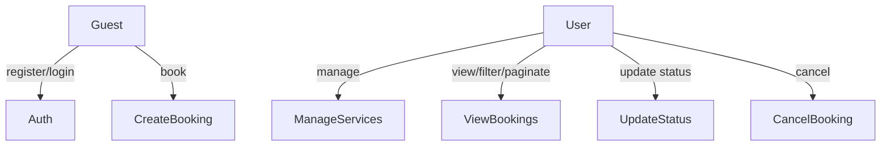
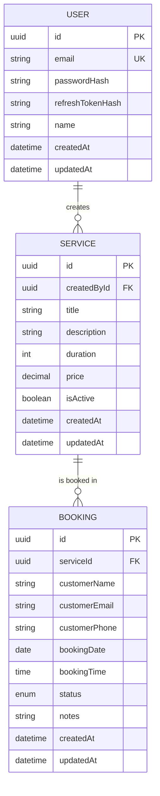

# Software Requirements Specification
## Booking Platform REST API — EN2H Technical Assessment

**Author:** BYTS
**Date:** 12 July 2026
**Stack:** NestJS, TypeScript, PostgreSQL, Prisma ORM, JWT (Argon2 Hashing)

---

## 1. Introduction

### 1.1 Purpose
This document specifies the functional and non-functional requirements for the Booking Platform REST API. The platform allows authenticated users (merchants) to manage services, and allows customers to create and manage reservations (bookings) against those services.

### 1.2 Scope
The system exposes a REST API only. It covers:
- User registration and login (dual JWT token authentication with rotation)
- Service CRUD, restricted to authenticated merchants
- Booking management, including public booking creation and protected merchant actions (view, status updates, cancellations)

### 1.3 Definitions
| Term | Meaning |
|---|---|
| User | A registered account holder (merchant) who manages services and reviews bookings. |
| Customer | A guest booking a service. Does not require a registered user account. |
| Service | A bookable offering defined by a duration, price, and active status. |
| Booking | A scheduled reservation of a Service for a specific customer on a date/time slot. |

---

## 2. Overall Description

### 2.1 Actors
- **Guest (Customer)** — Unauthenticated caller. Can register as a user, log in, or create a service booking.
- **Registered User (Merchant)** — Authenticated via JWT. Can create/update/delete services, and list/retrieve/cancel/update statuses of bookings.

### 2.2 Assumptions
- **Access Control**: Service management routes (`GET`, `POST`, `PATCH`, `DELETE` /services) are restricted to authenticated merchants to protect service list modification.
- **Booking Creation**: Open to the public without authentication to allow frictionless customer reservations.
- **Timezone**: Dates (`bookingDate`) and times (`bookingTime`) are normalized to UTC to prevent timezone boundary bugs. The booking date is validated at midnight UTC of the current calendar day.

---

## 3. Use Case Diagram



---

## 4. Entity-Relationship Diagram



---

## 5. System Architecture

Request filter and transformation lifecycle flow:
```
Client
  → Guards / Pipes / Interceptors   (JwtAuthGuard, ValidationPipe, TransformInterceptor)
  → Controllers                     (thin routing, endpoint declarations, Swagger specs)
  → Service Layer                   (encapsulates all business rules & validations)
  → Repository Layer (Prisma)       (data access mapper)
  → PostgreSQL Database
```

---

## 6. Non-Functional Requirements

| Category | Requirement |
|---|---|
| **Security** | Passwords and refresh tokens are hashed using **Argon2id**. Authentication utilizes dual JWTs: short-lived Access Tokens (15 min) and long-lived Refresh Tokens (7 days) with token rotation. Authenticated routes require standard Bearer Authorization headers. |
| **Scalability** | Cursor-based pagination (`limit`, `cursor`) on `/bookings` replaces offset pagination, ensuring stable `O(1)` query lookups regardless of database depth. |
| **Reliability** | A composite database unique constraint `@@unique([serviceId, bookingDate, bookingTime])` protects against slot double-bookings during concurrent transactions. |
| **Error Handling** | A global `AllExceptionsFilter` catches all execution, database (Prisma P2002), and validation exceptions, mapping them to the standard envelope structure. |

---

## 7. API Contract

Base URL: `/api/v1`

### 7.1 Response Enveloping

#### Success Envelope
```json
{
  "success": true,
  "data": { ... },
  "meta": {
    "requestId": "req_5d70c8c5",
    "timestamp": "2026-07-12T05:27:01.034Z",
    "apiVersion": "v1"
  }
}
```

#### Error Envelope
```json
{
  "success": false,
  "error": {
    "statusCode": 400,
    "message": "Error details here"
  },
  "meta": {
    "requestId": "req_5d70c8c5",
    "timestamp": "2026-07-12T05:27:01.034Z",
    "apiVersion": "v1"
  }
}
```

---

### 7.2 Auth Endpoints

#### `POST /auth/register`
*Public* — Create a new merchant user.
- **Request Body**:
  ```json
  {
    "email": "merchant@example.com",
    "password": "Password123!",
    "name": "Spa Salon"
  }
  ```
- **Response**: Standard success envelope with safe user object.

#### `POST /auth/login`
*Public* — Authenticate and retrieve token pair.
- **Request Body**:
  ```json
  {
    "email": "merchant@example.com",
    "password": "Password123!"
  }
  ```
- **Response**: Standard success envelope containing `accessToken`, `refreshToken`, and safe user info.

#### `POST /auth/refresh`
*Public* — Rotate tokens using current refresh token.
- **Headers**: `Authorization: Bearer <refresh_token>`
- **Response**: Standard success envelope containing new `accessToken` and `refreshToken` pair.

#### `POST /auth/logout`
*Protected* — Invalidates stored refresh token.
- **Headers**: `Authorization: Bearer <access_token>`
- **Request Body**:
  ```json
  {
    "refreshToken": "eyJhbGciOi..."
  }
  ```
- **Response**: Standard logout confirmation envelope.

---

### 7.3 Service Management Endpoints

#### `POST /services`
*Protected* — Create a new service.
- **Request Body**:
  ```json
  {
    "title": "Massage Therapy",
    "description": "Full body relaxation",
    "duration": 60,
    "price": 85.50
  }
  ```
- **Response**: Standard success envelope containing created service details.

#### `PATCH /services/:id`
*Protected* — Partial update of service attributes.
- **Request Body**: Fields from creation payload, plus optional `isActive` flag.

#### `DELETE /services/:id`
*Protected* — Remove a service by ID.

#### `GET /services`
*Protected* — Get list of all services.

#### `GET /services/:id`
*Protected* — Get detailed service properties by ID.

---

### 7.4 Booking Management Endpoints

#### `POST /bookings`
*Public* — Create a booking reservation slot.
- **Request Body**:
  ```json
  {
    "serviceId": "uuid-here",
    "customerName": "John Doe",
    "customerEmail": "john.doe@example.com",
    "customerPhone": "+15550199",
    "bookingDate": "2026-10-15",
    "bookingTime": "14:30",
    "notes": "Optional comment"
  }
  ```
- **Response**: Standard success envelope containing created booking details. Status defaults to `PENDING`.

#### `GET /bookings`
*Protected* — Retrieve paginated bookings.
- **Query Params**:
  - `search` (Search by customer name, email, or phone)
  - `status` (Filter by PENDING | CONFIRMED | CANCELLED | COMPLETED)
  - `limit` (Page item count, max 100, default 10)
  - `cursor` (UUID cursor for stable pagination)
- **Response**: Standard success envelope containing `{ items: [], nextCursor: "uuid" }`.

#### `GET /bookings/:id`
*Protected* — Fetch detailed booking record by ID.

#### `PATCH /bookings/:id/status`
*Protected* — Update status of a booking.
- **Request Body**: `{ "status": "CONFIRMED" }`
- **Business Rule**: Prevents `CANCELLED → COMPLETED` transitions.

#### `PATCH /bookings/:id/cancel`
*Protected* — Cancel booking record. Sets status to `CANCELLED`. Reject if already cancelled.

---

## 8. Business Rules Enforcement Map

| Business Rule | Level Enforced | Code Implementation Location |
|---|---|---|
| A booking must belong to an existing active service | Service Layer Validation | `BookingsService.create()` query verification |
| Booking dates cannot be in the past | Service Layer Validation | `BookingsService.create()` normalized midnight check |
| Cancelled bookings cannot be marked completed | Service Layer Validation | `BookingsService.updateStatus()` conditional validation |
| Only authenticated users can manage services | Guard Layer | `ServicesController` class-scoped `@UseGuards(JwtAuthGuard)` |
| Customers can create bookings without authentication | Open Route | `BookingsController.create()` lacks any guard |
| Prevent duplicate bookings for same service, date, and time | Database / Service | `schema.prisma` unique index + Prisma P2002 error catch |
